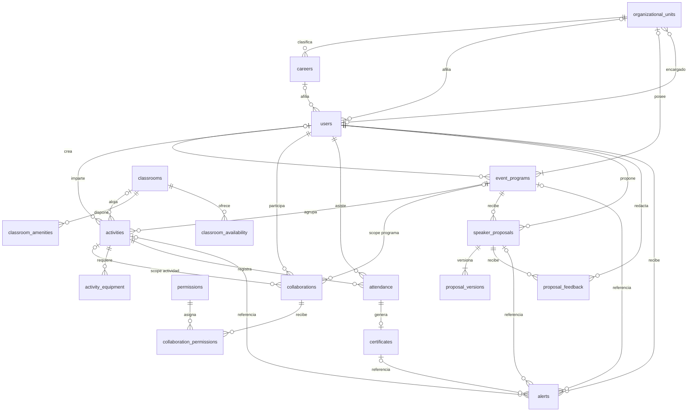

# Diseño ER propuesto y justificación - SIPEG UTP

> Estado: propuesta de diseño conceptual y lógico.
> Diagrama editable: [`er-diagram.drawio`](./er-diagram.drawio).
> Fuentes funcionales: [`AGENTS.md`](../../AGENTS.md) y [`CONTEXT.md`](../../CONTEXT.md).

---

## 1. Objetivo y alcance

El modelo organiza el dominio alrededor de dos conceptos distintos:

- **Programa de eventos**: agrupador administrativo perteneciente a una unidad organizativa.
- **Actividad**: evento individual que siempre pertenece a un programa de eventos.

El diseño cubre identidad académica, unidades organizativas, programas, actividades, colaboradores, permisos, asistencia, certificados, aulas, propuestas de ponentes, feedback, alertas y datos base para reportes.

### Decisiones de producto confirmadas

1. Toda actividad pertenece obligatoriamente a un programa de eventos.
2. Cada unidad organizativa tiene exactamente un programa predeterminado permanente.
3. El programa predeterminado se crea automáticamente en la misma operación que da de alta la unidad.
4. La condición predeterminada y la unidad propietaria de ese programa son inmutables.
5. Solo un administrador del sitio puede crear programas adicionales.
6. Cada programa pertenece exactamente a una unidad organizativa.
7. Los programas predeterminados no requieren fechas; los adicionales sí tienen inicio y fin.
8. Los programas se archivan en lugar de eliminarse físicamente.
9. Un programa adicional no puede archivarse mientras tenga actividades programadas o en curso.
10. Un programa predeterminado no puede archivarse mientras su unidad siga activa.
11. La reactivación de una unidad reactiva su programa predeterminado existente en la misma transacción.
12. Los permisos de un programa se heredan en sus actividades; una actividad puede tener colaboradores y permisos locales adicionales.
13. El ponente debe ser un usuario del sistema y conserva un historial versionado de propuestas con feedback.
14. `attendance` representa inscripción y presencia en un único registro con momentos diferenciados.

---

## 2. Resumen del modelo

El ER contiene **18 entidades** y **10 enums**.

### 2.1 Entidades

| Entidad                     | Propósito                                                          | Categoría     |
| --------------------------- | ------------------------------------------------------------------ | ------------- |
| `users`                     | Identidad de asistentes, colaboradores, administradores y ponentes | Identidad     |
| `organizational_units`      | Facultades y subdirecciones propietarias de programas y carreras   | Catálogo      |
| `careers`                   | Carreras asociadas a unidades organizativas y usuarios             | Catálogo      |
| `permissions`               | Catálogo de permisos granulares                                    | Catálogo      |
| `event_programs`            | Agrupadores permanentes o temporales de actividades                | Operacional   |
| `activities`                | Eventos individuales pertenecientes a un programa                  | Operacional   |
| `activity_equipment`        | Equipamiento requerido por una actividad                           | Puente        |
| `collaborations`            | Participación de un usuario en un programa o actividad             | Operacional   |
| `collaboration_permissions` | Permisos granulares de una colaboración                            | Puente        |
| `attendance`                | Inscripción y evidencia de presencia por actividad                 | Transaccional |
| `certificates`              | Certificado emitido a partir de una asistencia                     | Transaccional |
| `classrooms`                | Aulas y laboratorios                                               | Catálogo      |
| `classroom_amenities`       | Amenidades disponibles en un aula                                  | Puente        |
| `classroom_availability`    | Disponibilidad recurrente de un aula                               | Operacional   |
| `speaker_proposals`         | Propuesta vigente de un ponente para un programa                   | Transaccional |
| `proposal_versions`         | Historial inmutable de revisiones de una propuesta                 | Histórico     |
| `proposal_feedback`         | Feedback textual o visual de un encargado                          | Transaccional |
| `alerts`                    | Alertas internas dirigidas a usuarios                              | Transaccional |

### 2.2 Enums

| Enum                | Valores                                                                                                                                                              | Uso                              |
| ------------------- | -------------------------------------------------------------------------------------------------------------------------------------------------------------------- | -------------------------------- |
| `GlobalRole`        | `USER`, `ADMIN`                                                                                                                                                      | Rol global de usuario            |
| `UnitType`          | `FACULTY`, `SUBDIRECTORATE`                                                                                                                                          | Tipo de unidad organizativa      |
| `CollaborationRole` | `ORGANIZER`, `EDITOR`, `VIEWER`                                                                                                                                      | Rol en un programa o actividad   |
| `ProgramStatus`     | `DRAFT`, `ACTIVE`, `COMPLETED`, `CANCELLED`, `ARCHIVED`                                                                                                              | Ciclo de vida de programas       |
| `ActivityStatus`    | `DRAFT`, `SCHEDULED`, `ONGOING`, `COMPLETED`, `CANCELLED`                                                                                                            | Ciclo de vida de actividades     |
| `ClassroomType`     | `LABORATORY`, `CLASSROOM`                                                                                                                                            | Tipo de aula                     |
| `ActivityType`      | `WORKSHOP`, `SEMINAR`, `TALK`, `OTHER`                                                                                                                               | Tipo de actividad y propuesta    |
| `AttendanceMethod`  | `QR`, `MANUAL`                                                                                                                                                       | Método de registro de asistencia |
| `ProposalStatus`    | `PENDING`, `APPROVED`, `REJECTED`                                                                                                                                    | Estado vigente de una propuesta  |
| `AlertType`         | `PROPOSAL_RECEIVED`, `PROPOSAL_UPDATED`, `PROPOSAL_RESPONDED`, `PROGRAM_UPDATED`, `PROGRAM_ARCHIVED`, `ACTIVITY_UPDATED`, `ACTIVITY_CANCELLED`, `CERTIFICATE_ISSUED` | Tipo de alerta                   |

### 2.3 Atributos principales

#### `users`

- `id (PK)`
- `first_name`
- `last_name`
- `identification_number (UQ)`
- `email (UQ)`
- `global_role`
- `is_active`
- `unit_id (FK?)`
- `career_id (FK?)`
- `created_at`
- `updated_at`

La contraseña no vive en `users`: Better Auth la almacena en `accounts.password` (ver `docs/adr/adr-0001-time-aware-collaboration-authorization.md`).

#### `organizational_units` y `careers`

Ambos catálogos contienen `id`, `name`, `code (UQ)`, `description?`, `is_active`, `created_at` y `updated_at`. `organizational_units` agrega `type (UnitType)` y `head_id (FK?)` opcional hacia `users` para registrar al encargado. `careers` agrega `unit_id (FK)`.

#### `event_programs`

- `id (PK)`
- `name`
- `description?`
- `label?`
- `banner_url?`
- `is_default`
- `start_date?`
- `end_date?`
- `status`
- `organizational_unit_id (FK, NOT NULL)`
- `created_by_id (FK?)`
- `archived_at?`
- `created_at`
- `updated_at`

Restricciones:

- `organizational_unit_id` es obligatorio y usa `ON DELETE RESTRICT`.
- Un programa predeterminado no tiene fechas; uno adicional requiere fechas, etiqueta, banner y `start_date <= end_date`.
- Solo puede existir un programa predeterminado por unidad organizativa.
- `is_default` y la unidad propietaria son inmutables en programas predeterminados.
- Un programa predeterminado solo puede estar `ACTIVE` o `ARCHIVED`, y el último estado solo se permite cuando su unidad está inactiva.
- Reactivar una unidad exige cambiar su programa predeterminado existente a `ACTIVE` en la misma transacción.
- `status = ARCHIVED` y la presencia de `archived_at` deben ser equivalentes.
- `created_by_id` registra al administrador responsable de programas adicionales; puede ser nulo para altas automáticas o reconciliaciones del sistema.

#### `activities`

- `id (PK)`
- `name`
- `description?`
- `type`
- `date`
- `start_time`
- `end_time`
- `max_capacity?`
- `banner_url?`
- `status`
- `event_program_id (FK)`
- `classroom_id (FK?)`
- `speaker_id (FK?)`
- `created_at`
- `updated_at`

Restricciones:

- `event_program_id` es obligatorio y usa `ON DELETE RESTRICT`.
- `start_time < end_time` y `max_capacity > 0` cuando se informa capacidad.
- La fecha debe respetar el rango de un programa adicional.
- La asignación de aula debe respetar capacidad, disponibilidad y ausencia de solapes.

#### `collaborations` y `collaboration_permissions`

`collaborations` contiene `id`, `role`, `event_program_id?`, `activity_id?`, `user_id` y `created_at`. Un CHECK exige exactamente un scope. Índices únicos parciales evitan repetir un usuario dentro del mismo programa o actividad.

`collaboration_permissions` usa PK compuesta `(collaboration_id, permission_id)`.

#### `attendance` y `certificates`

`attendance` contiene `id`, `code (UQ)`, `registered_at`, `method?`, `checked_in_at?`, `activity_id` y `user_id`, con `UNIQUE (activity_id, user_id)`. La fila nace al registrarse con su propio código de validación y se completa al hacer check-in; el código es único global y se genera en la inscripción. Ver `docs/adr/adr-0004-attendance-checkin-codes.md`.

`certificates` contiene `id`, `code (UQ)`, `pdf_url?`, `issued_at` y `attendance_id (FK, UQ)`. La relación 1:0..1 impide más de un certificado por asistencia.

#### Aulas

- `classrooms`: identidad, tipo, capacidad, ubicación y estado activo.
- `classroom_amenities`: PK compuesta `(classroom_id, amenity)`.
- `classroom_availability`: aula, día, hora inicial, hora final y período opcional.

#### Propuestas y alertas

`speaker_proposals` pertenece obligatoriamente a un programa y a un usuario ponente. `proposal_versions` conserva una o más revisiones con `UNIQUE (proposal_id, version_number)`; la propuesta y su versión inicial se crean atómicamente. `proposal_feedback` exige texto o imagen.

`alerts` contiene destinatario, tipo, estado de lectura y una referencia opcional a propuesta, programa, actividad o certificado. Un CHECK exige exactamente una referencia.

---

## 3. Decisiones de diseño

Cada decisión se presenta como decisión, justificación y validación.

### D1. Claves primarias surrogadas

**Decisión:** las entidades operacionales usan identificadores CUID sin semántica de negocio.

**Justificación:** evitan propagar cambios de email, cédula o códigos naturales y no revelan una secuencia incremental.

**Validación:** email, identificación, códigos de catálogo, QR y código de certificado conservan restricciones `UNIQUE` independientes.

### D2. Estados separados para programas y actividades

**Decisión:** usar `ProgramStatus` y `ActivityStatus` en lugar de un enum compartido.

**Justificación:** un programa predeterminado permanece `ACTIVE` mientras su unidad esté activa y solo puede archivarse después de desactivarla; una actividad, en cambio, transita por estados de programación y ejecución.

**Validación:** separar los dominios evita estados inválidos como una actividad `ARCHIVED` o un programa predeterminado `ONGOING`. Un CHECK restringe los predeterminados a `ACTIVE` o `ARCHIVED`, otro mantiene coherentes `ARCHIVED` y `archived_at`, y la reactivación de unidad restaura `ACTIVE` atómicamente.

### D3. Colaboración con scope exclusivo

**Decisión:** `collaborations` referencia un programa o una actividad, exactamente uno de ellos.

**Justificación:** conserva un único concepto de colaboración, permite permisos locales y simplifica consultas por usuario sin perder integridad referencial.

**Validación:** el CHECK de scope y los índices únicos parciales impiden filas ambiguas y colaboradores duplicados.

### D4. Ponente como usuario y propuesta versionada

**Decisión:** el ponente referencia `users`; cada propuesta conserva estado vigente y versiones inmutables.

**Justificación:** evita duplicar identidad y permite el ciclo feedback, actualización y reevaluación sin destruir contenido anterior.

**Validación:** `UNIQUE (proposal_id, version_number)` identifica cada instantánea dentro de su propuesta. Cada alta crea la versión 1 en la misma transacción y cada actualización serializa el siguiente número y sincroniza los datos vigentes.

### D5. Feedback textual o visual

**Decisión:** `proposal_feedback` admite `content?` e `image_url?` con CHECK de presencia mínima.

**Justificación:** cubre ambos formatos sin payloads opacos y evita feedback vacío.

**Validación:** la autorización del autor se resuelve comprobando su colaboración efectiva en el programa de la propuesta.

### D6. Alertas con referencias reales

**Decisión:** cada alerta referencia exactamente una propuesta, programa, actividad o certificado.

**Justificación:** las FKs facilitan navegación, filtros e integridad. Los tipos distinguen cambios y archivado de programas de cambios y cancelación de actividades.

**Validación:** `certificate_id?` permite identificar el certificado en `CERTIFICATE_ISSUED`; los programas archivados y actividades canceladas permanecen disponibles para conservar la referencia.

### D7. `attendance` como inscripción y presencia

**Decisión:** un único registro por usuario y actividad nace como inscripción y se completa durante el check-in.

**Justificación:** es la decisión de producto vigente y la unicidad evita registros duplicados.

**Validación:** `registered_at` permite identificar inscritos antes de la actividad; `checked_in_at?` y `method?` distinguen presencia. El diseño todavía no representa cancelación, ausencia o lista de espera.

### D8. Certificado dependiente de asistencia

**Decisión:** el certificado referencia únicamente `attendance_id` y no duplica usuario ni actividad.

**Justificación:** ambos datos se derivan de la asistencia; duplicarlos permitiría inconsistencias.

**Validación:** `attendance_id (UQ)` establece una relación 1:0..1.

### D9. Equipamiento normalizado

**Decisión:** usar `activity_equipment (activity_id, name)` con PK compuesta.

**Justificación:** un atributo multivaluado impediría búsquedas y validación consistente.

**Validación:** cada nombre depende de la clave completa y no puede repetirse dentro de una actividad.

### D10. Tablas puente sin ID artificial

**Decisión:** `activity_equipment`, `classroom_amenities` y `collaboration_permissions` usan claves compuestas.

**Justificación:** no tienen atributos propios que requieran una identidad adicional.

**Validación:** la PK garantiza la unicidad del par y elimina índices redundantes.

### D11. Disponibilidad de aulas

**Decisión:** impedir slots exactamente duplicados y validar solapamientos de reservas mediante una exclusión temporal.

**Justificación:** un `UNIQUE` no detecta intervalos parcialmente solapados.

**Validación:** la exclusión por aula, fecha e intervalo protege incluso ante solicitudes concurrentes y solo considera estados que reservan aula (`SCHEDULED`, `ONGOING`). La pertenencia a un horario disponible sigue siendo una regla entre tablas.

### D12. Unidad organizativa y carrera de usuario

**Decisión:** conservar ambas referencias opcionales.

**Justificación:** existen usuarios vinculados a una unidad organizativa sin carrera. Cuando ambas existen, la carrera debe pertenecer a la unidad indicada.

**Validación:** el riesgo de inconsistencia requiere una validación transaccional o una solución relacional adicional.

### D13. Archivado de programas y borrado restringido

**Decisión:** los programas no se eliminan físicamente. `activities.event_program_id` es obligatorio y usa `ON DELETE RESTRICT` como defensa adicional.

**Justificación:** asistencia, certificados, reportes y permisos necesitan conservar el contexto organizativo histórico.

**Validación:** ninguna actividad puede quedar huérfana. El archivado cambia estado y `archived_at`, sin romper relaciones. La prohibición de borrar incluso programas vacíos se aplica retirando `DELETE` al rol de aplicación o mediante una guarda equivalente; `RESTRICT` por sí solo no cubre el caso vacío.

### D14. Desactivación de catálogos

**Decisión:** usuarios, unidades organizativas, carreras y aulas usan `is_active`.

**Justificación:** son entidades referenciadas por información histórica y no deben desaparecer por una operación administrativa ordinaria.

**Validación:** los listados operativos filtran entidades inactivas sin alterar datos pasados. La reactivación de una unidad y de su programa predeterminado se realiza en una única transacción.

### D15. Semántica temporal

**Decisión:** programas adicionales usan fechas de calendario, actividades usan fecha y horas locales, y auditoría usa instantes con zona horaria.

**Justificación:** los programas predeterminados son permanentes y mantienen fechas nulas; las actividades sí necesitan programación concreta.

**Validación:** la zona horaria institucional quedó definida como `America/Panama` (UTC-5, sin DST) en el [ADR-0002](../adr/adr-0002-institutional-timezone-panama.md); la política para actividades que crucen medianoche sigue pendiente.

### D16. Herencia de permisos calculada

**Decisión:** los permisos del programa no se copian en cada actividad; se combinan al calcular permisos efectivos.

**Justificación:** copiar permisos generaría anomalías al revocar o modificar permisos del programa.

**Validación:** el modelo actual solo representa concesiones. Por tanto, la combinación mínima coherente es una unión aditiva; una denegación local requeriría un tipo explícito `ALLOW`/`DENY`.

### D17. Programa obligatorio para toda actividad

**Decisión:** `activities.event_program_id` es `NOT NULL` y la cardinalidad es programa 1 a 0..N actividades.

**Justificación:** los programas predeterminados dan un padre válido a las actividades que no forman parte de un programa especial.

**Validación:** desaparecen actividades independientes, herencia condicional y códigos manuales ambiguos por padre nulo.

### D18. Tipo controlado de actividad

**Decisión:** `ActivityType` se comparte entre actividades, propuestas y versiones.

**Justificación:** mantiene coherencia entre lo propuesto y la actividad resultante; `OTHER` permite extensión controlada.

**Validación:** filtros y estadísticas usan un dominio estable.

### D19. Exclusión de solapes de aula

**Decisión:** impedir que dos actividades ocupen la misma aula, fecha e intervalo solapado.

**Justificación:** la validación en aplicación por sí sola puede fallar ante concurrencia.

**Validación:** intervalos semiabiertos `[inicio, fin)` permiten actividades consecutivas sin considerarlas solapadas.

### D20. Propiedad organizativa exclusiva

**Decisión:** un programa referencia exactamente una unidad organizativa mediante `organizational_unit_id`.

**Justificación:** facultades y subdirecciones comparten los mismos atributos y se modelan en una única tabla `organizational_units` diferenciada por `type`. Una sola FK obligatoria permite filtrar, autorizar y reportar sin ambigüedad y admite nuevos tipos de unidad sin migrar la relación.

**Validación:** `organizational_unit_id` es `NOT NULL` con `ON DELETE RESTRICT`; el tipo de unidad se conserva en `UnitType` (ver `docs/adr/adr-0003-unified-organizational-units.md`).

### D21. Programa predeterminado automático y único

**Decisión:** crear el programa predeterminado en la misma transacción que la unidad organizativa y proteger su unicidad mediante un índice parcial.

**Justificación:** una actividad siempre necesita programa y no debe depender de una configuración manual posterior.

**Validación:** el índice garantiza como máximo uno; la transacción de alta, la inmutabilidad de `is_default`/propietario y una reconciliación operativa garantizan el mínimo de uno. La cardinalidad de negocio es unidad 1 a 1..N programas, aunque el mínimo no surge de una FK aislada.

### D22. Creación administrativa y trazabilidad

**Decisión:** `event_programs.created_by_id?` registra el administrador de un programa adicional y, cuando está disponible, el actor que originó un programa predeterminado.

**Justificación:** una FK no puede comprobar por sí sola el rol global; la autorización se aplica antes de escribir y el creador queda auditable.

**Validación:** todo programa adicional exige `created_by_id` y `GlobalRole.ADMIN`. El campo puede ser nulo únicamente para creación automática o backfill del sistema, cuyo origen debe quedar en auditoría operativa.

### D23. Guardas de archivado

**Decisión:** bloquear el archivado de programas adicionales con actividades `SCHEDULED` u `ONGOING`, y bloquear el archivado del programa predeterminado mientras su unidad esté activa.

**Justificación:** archivar no debe ocultar ni invalidar operaciones vigentes.

**Validación:** el archivado bloquea primero el programa y su unidad propietaria. Solo los programas adicionales comprueban actividades `SCHEDULED`/`ONGOING`; los predeterminados comprueban el estado de la unidad. La creación y transición de actividades debe bloquear la misma fila de programa para cerrar carreras. Al reactivar una unidad se bloquean ambos registros y se restaura el programa a `ACTIVE` antes de confirmar.

---

## 4. Restricciones de integridad

### 4.1 CHECKs

```sql
CHECK (
  (is_default AND start_date IS NULL AND end_date IS NULL)
  OR
  (NOT is_default AND start_date IS NOT NULL AND end_date IS NOT NULL
    AND label IS NOT NULL AND banner_url IS NOT NULL AND start_date <= end_date)
)

CHECK (NOT is_default OR status IN ('ACTIVE', 'ARCHIVED'))

CHECK ((status = 'ARCHIVED') = (archived_at IS NOT NULL))

CHECK (is_default OR created_by_id IS NOT NULL)

CHECK ((event_program_id IS NOT NULL) <> (activity_id IS NOT NULL))

CHECK (
  NULLIF(BTRIM(content), '') IS NOT NULL
  OR NULLIF(BTRIM(image_url), '') IS NOT NULL
)

CHECK (start_time < end_time)

CHECK (max_capacity IS NULL OR max_capacity > 0)

CHECK (capacity > 0)

CHECK (
  (checked_in_at IS NULL AND method IS NULL)
  OR
  (checked_in_at IS NOT NULL AND method IS NOT NULL
    AND checked_in_at >= registered_at)
)
```

El CHECK de `alerts` debe exigir exactamente una referencia entre `proposal_id`, `event_program_id`, `activity_id` y `certificate_id`, y que esa referencia corresponda al grupo de `AlertType`: propuesta, programa, actividad o certificado.

### 4.2 Unicidad parcial

```sql
CREATE UNIQUE INDEX event_programs_default_unit_key
  ON event_programs (organizational_unit_id)
  WHERE is_default;

CREATE UNIQUE INDEX collaborations_program_user_key
  ON collaborations (event_program_id, user_id)
  WHERE event_program_id IS NOT NULL;

CREATE UNIQUE INDEX collaborations_activity_user_key
  ON collaborations (activity_id, user_id)
  WHERE activity_id IS NOT NULL;
```

Los índices garantizan máximos, no mínimos. La existencia de un predeterminado se sostiene con creación transaccional y reconciliación. La inmutabilidad de `is_default` y de la unidad propietaria requiere una guarda centralizada o trigger; los programas adicionales no pueden convertirse en predeterminados mediante una actualización ordinaria.

### 4.3 Exclusión de aula

La implementación en PostgreSQL requiere `btree_gist` y una exclusión equivalente a:

```sql
ALTER TABLE activities ADD CONSTRAINT activities_classroom_no_overlap
  EXCLUDE USING gist (
    classroom_id WITH =,
    date WITH =,
    tsrange((date + start_time)::timestamp, (date + end_time)::timestamp, '[)') WITH &&
  ) WHERE (classroom_id IS NOT NULL AND status IN ('SCHEDULED', 'ONGOING'));
```

---

## 5. Validación de normalización

### 5.1 Primera forma normal

- Todos los atributos son escalares.
- Equipamiento y amenidades viven en relaciones separadas.
- No existen listas serializadas ni payloads JSON usados como sustituto de relaciones.

### 5.2 Segunda forma normal

Las tablas con claves compuestas son puentes puros:

| Tabla                       | Clave                               |
| --------------------------- | ----------------------------------- |
| `activity_equipment`        | `(activity_id, name)`               |
| `classroom_amenities`       | `(classroom_id, amenity)`           |
| `collaboration_permissions` | `(collaboration_id, permission_id)` |

No contienen atributos dependientes de una parte de la clave.

### 5.3 Tercera forma normal y BCNF

- Los certificados no duplican usuario ni actividad; ambos se derivan de la asistencia.
- Las versiones dependen de `(proposal_id, version_number)`.
- Los permisos dependen de la colaboración completa.
- Los programas guardan una única FK organizativa obligatoria, por lo que cada programa tiene exactamente una unidad propietaria.

La redundancia controlada más relevante sigue siendo `users.unit_id` junto con `users.career_id`. Su coherencia debe validarse expresamente.

---

## 6. Flujos derivados del modelo

### 6.1 Alta de unidad y programa predeterminado

1. Un administrador crea una unidad organizativa (`FACULTY` o `SUBDIRECTORATE`) y opcionalmente registra su `head_id`.
2. En la misma transacción se crea su programa predeterminado con `is_default = true`, `status = ACTIVE` y fechas nulas.
3. La operación completa se confirma solo si ambos registros fueron creados.
4. El índice parcial evita un segundo programa predeterminado para la misma unidad.
5. `is_default` y la FK de la unidad quedan inmutables.
6. Si una unidad inactiva se reactiva, su programa predeterminado existente vuelve a `ACTIVE` en la misma transacción.

### 6.2 Creación de programa adicional

1. Se verifica que el usuario sea administrador global.
2. Se elige exactamente una unidad organizativa.
3. Se validan nombre, fechas y metadatos.
4. Se registra el administrador en `created_by_id`.
5. El programa inicia en `DRAFT` y puede pasar a `ACTIVE` cuando cumpla las reglas de publicación.

### 6.3 Creación de actividad

1. Se selecciona un programa activo.
2. Se validan fecha, horas, capacidad, ponente, aula y equipamiento.
3. Para programas adicionales, la fecha debe quedar dentro de su rango.
4. Se comprueban capacidad y disponibilidad del aula.
5. Se crea la actividad con `event_program_id` obligatorio.

### 6.4 Resolución de permisos

1. Se obtienen colaboraciones y permisos del programa.
2. Se obtienen colaboraciones y permisos locales de la actividad.
3. Mientras solo existan concesiones, el conjunto efectivo es la unión de ambos scopes.
4. El rol global `ADMIN` se evalúa por separado.

### 6.5 Archivado de programa

1. Se bloquean el programa y su unidad propietaria dentro de una transacción.
2. Si es predeterminado, se rechaza mientras la unidad esté activa.
3. Si es adicional, se rechaza cuando tenga actividades `SCHEDULED` u `ONGOING`.
4. La creación y transición de actividades usa el mismo bloqueo del programa.
5. Se generan las notificaciones requeridas.
6. Se cambia el estado a `ARCHIVED` y se registra `archived_at`.

### 6.6 Propuesta, asistencia y certificado

- Una propuesta y su versión inicial se crean atómicamente dentro de un programa; tras aprobación, el ponente puede asignarse a una actividad concreta.
- La asistencia nace como inscripción y luego se completa mediante QR o código manual, conservando una sola fila por usuario y actividad.
- Un certificado se genera desde una asistencia elegible y puede producir una alerta vinculada al certificado.

---

## 7. Supuestos y limitaciones

1. `attendance` distingue registro y presencia por timestamps, pero no representa cancelación, ausencia ni lista de espera.
2. La precedencia de permisos es aditiva porque no existe una denegación explícita.
3. Ponente y aula pueden ser nulos en borrador; su obligatoriedad al programar depende del tipo o modalidad de actividad.
4. La modalidad presencial, virtual o híbrida todavía no está modelada.
5. No existe una tabla de auditoría administrativa general.
6. La zona horaria institucional quedó resuelta como `America/Panama` (UTC-5, sin DST) en el [ADR-0002](../adr/adr-0002-institutional-timezone-panama.md); la política para actividades que cruzan medianoche sigue pendiente.
7. `cv_url`, `banner_url` y `pdf_url` representan referencias a almacenamiento externo; el modelo no contiene metadata completa del archivo.
8. El ER garantiza como máximo un programa predeterminado por unidad; la creación automática, inmutabilidad y reconciliación garantizan el mínimo operativo de uno.
9. Desactivar una unidad permite archivar su programa predeterminado; el efecto sobre actividades activas sigue pendiente de la política de retención.
10. La actividad se conserva como `CANCELLED` cuando sea necesario mantener asistencia, certificados o auditoría; el borrado físico queda sujeto a retención.

---

## 8. Consideraciones de despliegue de base de datos

1. Crear primero enums y catálogos; después unidades, usuarios, programas y actividades; finalmente tablas transaccionales.
2. Instalar y autorizar `btree_gist` antes de activar la exclusión de aulas.
3. Crear los programas predeterminados de forma idempotente para unidades organizativas existentes.
4. Validar duplicados antes de activar índices únicos parciales.
5. Verificar solapes de aula antes de crear la restricción de exclusión.
6. Aplicar constraints después de limpiar fechas, horas, capacidades y scopes inválidos.
7. Tratar cambios de enums como migraciones coordinadas; renombrar o retirar valores requiere conversión de datos.
8. Crear índices para FKs, fechas, estados, destinatarios de alertas y filtros organizativos.
9. Respaldar y probar restauración antes de cambios destructivos.
10. Coordinar la retención de registros con la eliminación de CV, banners y PDFs en almacenamiento externo.

Índices de consulta recomendados:

- `event_programs(organizational_unit_id, status)`
- `activities(event_program_id, date, status)`
- `activities(classroom_id, date, start_time)`
- `collaborations(user_id)`
- `attendance(user_id, checked_in_at)`
- `speaker_proposals(event_program_id, status, submitted_at)`
- `alerts(recipient_id, is_read, created_at)`

---

## 9. Vista ER en Mermaid



La FK obligatoria de `event_programs` hacia `organizational_units` garantiza que cada programa tiene exactamente una unidad propietaria. El mínimo de un programa por unidad es una cardinalidad de negocio sostenida por la creación automática y reconciliación, no por una FK aislada.

---

## 10. Trazabilidad requisito a ER

| Requisito                                                    | Soporte en el ER                                         | Estado                                 |
| ------------------------------------------------------------ | -------------------------------------------------------- | -------------------------------------- |
| Programa predeterminado por unidad organizativa              | Índice parcial + creación/reconciliación transaccional   | Parcial en BD; cubierto operativamente |
| Creación automática del predeterminado                       | Transacción unidad + programa                            | Regla de servicio                      |
| Solo administrador crea programas adicionales                | `created_by_id` + `GlobalRole.ADMIN`                     | Regla de autorización                  |
| Programa pertenece a una sola unidad                         | `organizational_unit_id NOT NULL` + FK RESTRICT          | Cubierto                               |
| Programa predeterminado permanente                           | Fechas nulas, estados restringidos y guarda de archivado | BD + regla transaccional               |
| Reactivación de unidad y programa predeterminado             | Cambio atómico de ambos estados                          | Regla transaccional                    |
| Programas adicionales con fechas, etiqueta y banner          | CHECK condicional                                        | Cubierto                               |
| Toda actividad tiene programa                                | `activities.event_program_id NOT NULL`                   | Cubierto                               |
| Herencia de permisos                                         | `collaborations` + cálculo aditivo                       | Cubierto conceptualmente               |
| Permisos locales de actividad                                | Scope `activity_id`                                      | Cubierto                               |
| Archivar, no borrar programas                                | Estado, timestamp y prohibición de `DELETE`              | Regla de servicio/privilegios          |
| Bloquear archivo de adicional con actividad activa           | Estados y regla transaccional                            | Regla de servicio                      |
| Actividad con ponente, aula, fecha, hora y equipo            | `activities` + relaciones                                | Parcial: obligatoriedad condicional    |
| Registro previo y asistencia QR/manual sin duplicados        | `registered_at`, check-in opcional y UQ                  | Cubierto                               |
| Certificado único por asistencia                             | `certificates.attendance_id UQ`                          | Cubierto                               |
| Disponibilidad y anti-solape de aulas                        | Disponibilidad + exclusión temporal                      | Parcial: validación entre tablas       |
| Propuesta con CV, versiones y feedback                       | Propuestas, versiones y feedback                         | Parcial: CV y duración opcionales      |
| Alertas de propuestas, programas, actividades y certificados | `alerts` + `AlertType`                                   | Cubierto                               |
| Reportes por unidad, programa y actividad                    | FKs organizativas y datos transaccionales                | Cubierto como fuente de datos          |
| Auditoría administrativa completa                            | Sin `audit_logs`                                         | Pendiente                              |
| Cancelación, ausencia y lista de espera                      | Sin estado específico                                    | Pendiente                              |

---

## 11. Referencias

- Codd, E. F. (1970). _A Relational Model of Data for Large Shared Data Banks_.
- Codd, E. F. (1971). _Further Normalization of the Data Base Relational Model_.
- Boyce, R. y Codd, E. F. (1974). Forma normal de Boyce-Codd.
- PostgreSQL: índices parciales, constraints `CHECK`, tipos temporales y `EXCLUDE USING gist`.
